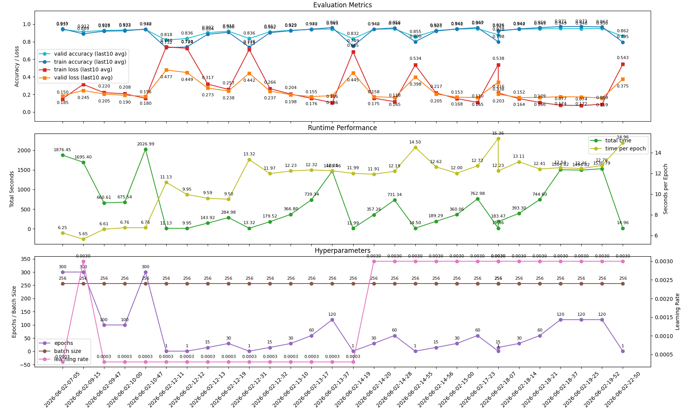

##  🖋️はじめに

こんにちは。Hinataです。

今回は、FashionMNISTの分類タスクで **accuracy 95%** に到達するまでに行った試行錯誤をまとめます。

最初からうまくいったわけではなく、MLPから始め、CNNへ移行し、学習率やepoch数、weight_decay(重み減衰)、scheduler、モデル構造を少しずつ調整しながら精度を伸ばしていきました。
## 🤔 背景

機械学習の学習を進める中で、まずは基本的な画像分類タスクを自分で実装し、モデル改善の流れを理解したいと考えました。

そこで題材として選んだのがFashionMNISTです。

FashionMNISTは、衣類画像を10クラスに分類するデータセットです。MNISTのように扱いやすい一方で、手書き数字よりは難しく、CNNの構造やハイパーパラメータの違いが結果に現れやすいです。

開発を初めたときから、acc>=95%を目標にしていました。
この目標に向けて、様々な情報を見ながら実験を追跡しました。

環境構築の一環で、初めてCI/CDのようなパイプラインも作成しました。
どの変更がどの結果につながったのかを後から追えるようにしたことも、目標達成の大きな要因だったのではないかと思っています。

この記事では、単に「最終的にこういうモデルで95%を超えました」という話ではなく、そこに至るまでに何を試し、何が失敗して、何が成功したのかを振り返ります。

## 👨‍💻技術の紹介

今回扱った主な技術要素は、以下の通りです。

```text
CNN
BatchNorm
Dropout
Weight Decay
CosineAnnealingLR
```

ディレクトリ構造はこんな形に為りました。
```
.
├── AGETNS.md -> CLAUDE.md
├── CLAUDE.md
├── data
│   └── FashionMNIST
│       ├── logs
│       └── models
├── docs
├── scripts
├── src
│   ├── CONSTANTS.py
│   ├── main.py
│   ├── model
│   │   ├── CNN
│   │   ├── CNN-v2
│   │   ├── MLP
│   │   └── module
│   ├── scripts
│   ├── train.py
│   └── util
└── tests

```

最初はMLP、つまり画像を1列に並べて、全結合層で分類するモデルから始めました。

しかしFashionMNISTで95%を狙うには、画像の空間的な構造を活かせるCNNの方が有利です。そのため、途中から主戦場をCNNへ移しました。

## GOOD1 : まずMLPからCNNへ移行した 🏞️

最初の実装はMLPベースでした。

しかし、FashionMNISTは画像分類タスクなので、単純に画像をflattenして扱うよりも、畳み込みによって局所的な特徴を捉えるCNNの方が自然です。
そこで早い段階でMLPを粘るのをやめ、CNNへ移行しました。
## GOOD2 : 学習率とepoch数で93%台へ  📑

CNNに移行した後、最初に試したのは分類器(Classifier)の部分の変更でした。

例えば、全結合層を追加したり、Dropoutを入れたり、headの幅を広げたりしました。

結果として、多少の改善はありましたが、劇的な変化はありませんでした。

一方で、学習率とepoch数の調整はかなり効果がありました。
ここから分かったのは、単純なCNNの段階では「層を増やす」よりも、まず学習を安定させることが重要だったということです。

## BAD1 : 強すぎる調整は逆効果 😭

次に、BatchNormや高めのlearning rateを導入しました。

変更内容としては、以下のようなものです。

```text
Conv層の後にBatchNormを追加
ReLU(inplace=True)を使用
weight decayを導入
learning rateを3e-3へ引き上げ
```

一見すると、筋の良い変更に思ったのですが、この変更ではvalid accuracyが大きく崩れました。

その後、learning rateを下げ直し、weight decayも調整すると精度は回復しました。

ここから分かったのは、良さそうな技術を入れれば必ず改善するわけではないということです。

特に、モデルの容量や構造に対してlearning rateが高すぎると、学習が不安定になります。

BatchNormや高learning rateは強力ですが、使うタイミングやモデル構造との相性が重要だと感じました。

## GOOD3 : ハイパラで詰まったら構造を見直す 📝

次の大きな転換点は、CNN-v2の導入でした。

CNN-v2では、VGG風のConvBlockを使い、畳み込み層をより深くしました。

具体的には、次のような方向です。

```text
VGG風のConvBlockを導入
畳み込みを深くする
augmentationを整理
normalizeを整理
classifierを拡張
Dropoutを重くしすぎないように調整
```

最初の1epochのsmoke testでは精度は高くありませんでした。

しかし、3段目のConvBlockを追加し、classifierを整え、epoch数を伸ばしていくと、valid accuracyは94%台前半まで伸びました。

ここで分かったのは、モデル構造の改善は、短い学習だけでは評価しにくいということです。

より強いモデルは、短いepochでは逆に弱く見えることがあります。十分に学習させて初めて、その構造の良さが見えてきます。

## 📆 最後はスケジューリングと正則化の勝負

CNN-v2で94%台に乗った後は、大きな構造変更よりも、学習スケジュールと正則化の調整が中心になりました。

この段階で精度向上に貢献していたのは、主に以下です。

```text
CosineAnnealingLR
learning rate = 3e-3
weight decayの微調整
epoch数の段階的な増加
```

CosineAnnealingLRを導入し、高めのlearning rateから徐々に学習率を下げることで、学習の進み方がかなり良くなりました。

また、epoch数を1、15、30、60、120のように段階的に伸ばしながら、どのくらい学習させると精度が伸びるのかを確認しました。

この時点では、モデル構造はすでに十分強くなっていました。

そのため、最後の1%は構造の大改造ではなく、schedulerやweight decayのような細かい調整で詰めていく段階だったと考えています。

## 🫸最後の一押しはweight_decayだった

95%到達の決定打は、新しい層を追加することではありませんでした。

最後にトドメを刺したのは、重み減衰の減衰率の調整でした。

```text
WEIGHT_DECAY: 3e-5 -> 1e-4
```

この変更によって、初めて95%に到達しました。

記録としては、次の通りです。

```text
valid_accuracy_last10_avg = 0.95001
train_logs.csv上の単発最大valid_accuracy = 0.9506
best_checkpoint.txtの最良loss時点のvalid_accuracy = 0.9485
```

ここで重要なのは、95%到達が「best checkpointのaccuracy」ではなく、直近10epoch平均で起きている点です。

つまり、lossが最小だったcheckpointでは94.85%でしたが、学習後半の平均的なaccuracyとしては95%を超えていました。

このあたりは、accuracyだけを見るのか、loss最小のcheckpointを見るのか、直近平均を見るのかで解釈が変わります。

実験結果を評価するときは、単発の最大値だけでなく、平均値やcheckpointの基準も見る必要があると感じました。

## 👷最終構成

最終的な方向性は、ざっくり以下のような構成でした。

```text
Dataset:
  FashionMNIST

Model:
  CNN-v2
  VGG風ConvBlock
  ConvBlockを3段構成
  classifierを拡張
  BatchNorm
  Dropout

Training:
  optimizer
  weight_decay = 1e-4
  learning rate = 3e-3
  CosineAnnealingLR
  長めのepoch数
```

実験の流れとしては、次のようになります。

```text
MLP
↓
単純CNN
↓
単純CNNのlearning rate / epoch数調整
↓
CNN-v2
↓
ConvBlock追加
↓
classifier調整
↓
CosineAnnealingLR導入
↓
epoch数を伸ばす
↓
weight decayを調整
↓
95%到達
```

今回の実験で特に良かったのは、ログを使って、後から実験の流れを読み返せる状態にしていたことです。

機械学習では、何度も実験しているうちに「どの設定が良かったのか」が分からなくなりがちです。

そのため、実験結果をCSVで残し、モデルソースやcheckpoint情報も保存しておくことは非常に重要だと感じました。



## ✅ まとめ

今回、FashionMNISTでaccuracy 95%に到達するまでにやったことをまとめると、次の4つです。

```text
CNN化
単純CNNをlearning rateとepoch数で93%台後半まで押し上げる
CNN-v2で構造を強くして94%台後半へ乗せる
最後はschedulerとweight decayを詰めて95%を超える
```

最終的な95%到達は、何か1つの大きな発明によるものではなく、むしろ次のような地道な積み上げでした。

```text
観測基盤を作る
実験結果を比較できるようにする
モデル構造を段階的に改善する
学習率やepoch数を調整する
失敗した設定から戻る
最後にregularizationを詰める
```

この開発を通して一番強く感じたのは、機械学習では「実験を管理する力」がかなり重要だということです。

モデルを改善するとき、ただコードを書き換えるだけでは、何が精度向上の要因か分からなくなります。

ログを残し、条件を変え、結果を比較し、失敗したら戻る。このサイクルを回せる状態を作ることが、精度改善の基盤になります。

また、95%に届いた最後の変更がweight decayだったことも印象的でした。

精度が伸び悩んだとき、ついモデルをもっと複雑にしたくなります。しかし、ある程度モデルが強くなった後は、構造追加よりも、学習スケジュールや正則化の微調整の方が近道のことがあります。

僕の開発の道筋はまさにそれを表していると思います。

```
MLP
↓
CNN(91~92%)
↓
パラメーター調整(93~93.5%)
↓
CNN-v2(94~94.5%)
↓
パラメーター調整 95%達成🎉
```

## 🎬 さいごに

機械学習の精度改善では、うまくいった最終コードだけを見ると、簡単に見えることがあります。

しかし実際には、その裏側に大量の試行錯誤があります。

今回のFashionMNISTでも、Dropoutを入れて悪化したり、BatchNormと高learning rateで崩れたり、classifierを強くしても短期では効果が見えなかったりしました。

それでも、ログを残して比較できる状態にしていたことで、どの方向に進めばよいかを判断できました。

これから機械学習を始める人には、モデルの構造だけでなく、実験を記録する仕組みも一緒に作ることをおすすめします。

小さなCSVログでも、後から見返すと大きな価値があります。

今回の95%到達は、深い理論的ジャンプというより、観測と改善を繰り返した結果でした。

地道な実験管理こそが、精度改善の一番強い武器になると思いました。