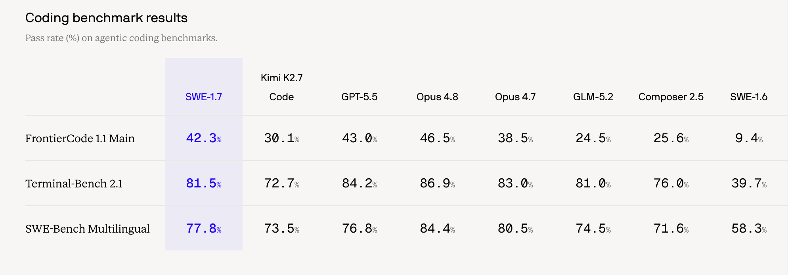
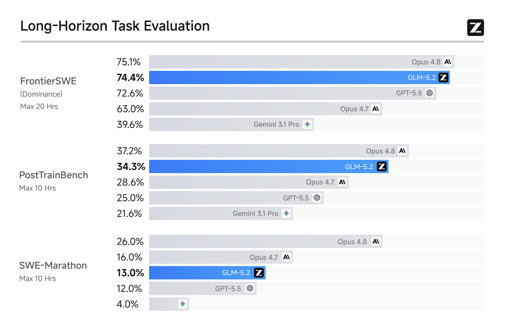

# トークンが足りなさ過ぎて、Windsurfを契約した話

※本記事のサービス内容、料金、モデルの提供状況は2026年7月時点のものです。

## 🎬 はじめに

僕は日々のコーディングや、参加しているプロジェクトの開発で、CodexとClaudeをかなり頻繁に使っています。

どちらも実装や調査を進めるうえで欠かせない存在になっていますが、使う時間が増えるにつれて、別の問題が出てきました。

トークンが足りません。

片方の利用上限に近づいたら、もう片方へ移る。しばらくはこの運用で乗り切っていましたが、開発量が増えると、CodexとClaudeの両方が使いにくくなる時間帯が発生するようになりました。

モデルの性能に不満があるわけではありません。むしろ、性能が高く、任せられる作業が増えたからこそ、利用可能量がボトルネックになりました。

そこで、3つ目の選択肢としてWindsurfを契約しました。

現在、Windsurfは「Devin Desktop」という名称になっています。2026年6月2日に、Windsurfの次世代版としてDevin Desktopが発表されました。この記事では、自分が契約を検討していたときの呼び方に合わせて、基本的にWindsurfと表記します。

本記事では、Windsurfを選んだ理由と、SWE-1.7、Claude Fable 5、GLM-5.2を実際に使って感じたことをまとめます。

## 🪣 CodexとClaudeだけでは足りなくなった

現在契約しているサービスは、次の3つです。

| サービス    | 契約内容 | 主な用途                | コスト |
| ------- | ---- | ------------------- | --- |
| ChatGPT | Plus | Codex、調査、実装         | 20$ |
| Claude  | Pro  | 設計、実装、コードの理解        | 20$ |
| Devin   | Pro  | Windsurf、複数モデルの使い分け | 20$ |

DevinのProプランは、2026年7月時点で月額20ドルです。Devin Desktopに加えて、複数のモデルやDevin Cloudも利用できます。

今回の契約目的は、CodexやClaudeより優れたモデルを探すことではありません。

AIに依頼できる作業量を増やし、特定のサービスの利用上限に依存しすぎない開発環境を作ることが目的でした。

これまで私は、AIコーディングツールを主にモデルの性能で見ていました。

- コードを正確に理解できるか
    
- ユーザーの意図を汲み取れるか
    
- 複数ファイルにまたがる変更ができるか
    
- バグの原因を特定できるか
    

しかし、日常的に使い続けるようになると、それ以外の要素も重要になります。

どれだけ高性能でも、必要なときに利用できなければ開発は止まります。モデルの性能だけでなく、利用上限、速度、コスト、選択肢の多さまで含めて環境を考える必要がありました。


## 📝 Windsurf(devin)を選んだ理由

Windsurfを選んだ最大の理由は、SWE-1.7を使ってみたかったからです。

高速で、エージェントとしての自律性も高いと聞き、日々の開発でどの程度使えるのか試したいと考えました。

もう一つの候補はGLMでした。

GLMはコストの低さが魅力的だったため、最初は直接契約することも検討しました。しかし、決済時にクレジットカードが弾かれてしまい、契約できませんでした。

その後、Windsurf内からGLM-5.2を利用できることが分かりました。

結果として、SWE-1.7を使うために契約したWindsurfが、GLMを含む多様なモデルへの入口にもなりました。

Windsurfの魅力は、一つのサービスの中で複数のモデルを切り替えられることです。Proプランでは、OpenAI、Claude、Geminiなどのモデルを含む、広いモデル選択肢が提供されています。

### 🤖 Devinで現在使えるAIモデル一覧

| 自動選択 | Adaptive | タスクに応じて適切なモデルを自動選択するルーター |
| ---- | -------- | ------------------------ |
|Cognition|SWE-1.7|最新のソフトウェアエンジニアリング向けモデル|
|Cognition|SWE-1.7 Lightning|SWE-1.7と同等の知能を、Cerebras上でより高速に提供|
|Cognition|SWE-1.6|速度、知能、操作感のバランスを重視|
|Cognition|SWE-1.6 Fast|SWE-1.6の高速版。有料ユーザー向け|
|Cognition|SWE-1.5|高速なエージェント型コーディングモデル|
|Cognition|SWE-1|初代のエージェント型コーディングモデル|
|OpenAI|GPT-5.6 Sol|GPT-5.6系の最上位。長時間の自律作業や複雑な推論向け|
|OpenAI|GPT-5.6 Terra|性能とコストのバランスを重視|
|OpenAI|GPT-5.6 Luna|GPT-5.6系で最も高速かつ低コスト|
|OpenAI|GPT-5.5|GPT-5.6以前の高性能モデル|
|Anthropic|Claude Fable 5|長期的な推論、デバッグ、複雑なタスク向けの上位モデル|
|Anthropic|Claude Sonnet 5|高いコーディング性能と比較的低いコストを両立|
|Anthropic|Claude Opus 4.8|複雑な問題分析や長時間タスク向け|
|Zhipu AI|GLM 5.2|低コストで、明確に定義されたタスクに向く|
|Moonshot AI|Kimi K2.7|オープン系のエージェント・コーディングモデル|

高性能なモデル、応答が速いモデル、低コストなモデルを、タスクに合わせて選べます。

これは、基本的に特定のモデルを中心として使うCodexやClaudeとは異なる体験でした。

## 🎥 Promo枠で新しいモデルを試しやすい

Windsurfには、新しいモデルや低コストモデルを無料、あるいは通常より軽い負担で利用できる期間があります。

私が使い始めた時期にも、複数のモデルがPromo対象になっていました。

例えば、GLM-5.2は2026年6月24日にDevin Desktopへ追加され、Pro、Max、Teamsプランでは7月5日まで無料で提供されていました。

また、SWE-1.7は7月8日に公開され、公式ドキュメントでは8月8日まで無料プレビューとして案内されています。

> [!info] ?
> 何故か僕が契約した時点(7/10)でもGLMやSWEがPromo枠として無料で提供されていました。何かのキャンペーンだったのでしょうか?


新しいモデルが出るたびに個別のAPIやサービスを契約するのは大変です。

一つの環境から複数のモデルを試せることで、「名前は聞いたことがあるが、契約するほどか分からない」というモデルにも触れやすくなりました。

ただし、Promo対象や期限は頻繁に変わります。記事を読んだ時点で同じ条件が提供されているとは限らないため、実際のモデルセレクターを確認する必要があります。

## 🤔 各モデルのレビュー

ここからは、僕がDevinを契約してから使った二つのモデルについてレビューしていきたいと思います。


## 💻 SWE-1.7：とにかく速い

最も驚いたのはSWE-1.7です。

一言で表すなら、爆速でした。

私が依頼したタスクでは、約50分にわたって、ほとんど介入せずに自律的な作業を続けました。

単にコードを一度生成して終わるのではなく、コードベースを調査し、必要なファイルを読み、実装を進め、結果を確認しながら次の作業へ移っていました。

Skillの作成を依頼したときには、30秒ほどで作ってきました。

もちろん、作業内容によって時間は変わります。しかし、少なくとも私が試した範囲では、考えている時間やツールを呼び出す間の待ち時間が短く、非常に軽快でした。

SWE-1.7は、長時間のソフトウェア開発タスクを意識して最適化されたモデルとして公開されています。Cognitionも、コードベースを広く調査し、エッジケースや依頼範囲の周辺まで検討する傾向を説明しています。

この性質は、根本原因を調査するタスクでは大きな強みになります。

一方で、注意も必要でした。



## 😵‍💫 自律性が高すぎることへの不安

あるとき、一つのタスクを依頼したところ、SWE-1.7が依頼した範囲を超えて、いろいろな部分を変更し始めました。

本人としては、問題を根本から解決するために必要だと判断したのかもしれません。しかし、こちらとしては、そこまで広い変更を求めていませんでした。

自律性が高いことと、ユーザーの意図どおりに動くことは同じではありません。

高速で長時間動けるエージェントほど、方向を間違えたときの影響も大きくなります。

そのため、僕はSWE-1.7へ依頼するときは、以前よりも作業範囲を明示するようになりました。

例えば、次のような条件を最初に渡します。

- 変更してよいディレクトリ
    
- 変更してはいけないファイル
    
- リファクタリングを行ってよいか
    
- 新しい依存関係を追加してよいか
    
- 完了条件
    
- 実行するテスト
    
- 実装前に計画を提示するか
    

また、作業用のブランチを分け、Gitの差分を確認してから採用することも重要です。

AIエージェントの性能が上がるほど、人間側には「どう実装するか」だけでなく、「どこまで任せてよいか」を設計する能力が必要になると感じました。

## 番外編 : Claude Fable 5

モデル選択欄には、Claude Fable 5もありました。

最初に名前を見たときは、「本当にFable 5で合っているのか」と少し不安になりましたが、正式なモデル名です。

Claude Fable 5は2026年7月1日から、Devin Cloud、Devin Desktop、Devin CLIで利用可能になっています。

7/10日時点で日本での利用は一時終了しているはずなので、おそらくバックドアだと思います。
僕はコストが高いので使っていませんが、どうしてもFable5が使いたい方はDevinを契約するのが良いかもしれません。


## 🐎 GLM-5.2：圧倒的に低コストだが、明確な指示が必要

GLM-5.2の魅力は、やはりコストです。

上位モデルを使うほどではないタスクを大量に処理したい場合、非常に魅力的な選択肢です。

一方で、私が使った範囲では、CodexやClaudeほどユーザーの意図を汲み取ってくれませんでした。

ClaudeやCodexでは、「この部分をいい感じに直してほしい」という少し曖昧な依頼でも、コードベースの構造や会話の流れから、ある程度こちらの意図を推測してくれます。

GLM-5.2では、そのような「Vibe感」が少ないと感じました。

こちらが期待している変更の範囲や、なぜ変更するのかを省略すると、表面的には指示に従っていても、求めていた結果とは異なるものが返ってくることがあります。

理解力がないというより、暗黙の要件を補完する能力が、上位モデルと比べて弱いという印象です。

そのため、GLM-5.2を使う場合は、次のように要件を具体化した方が安定しました。

```text
対象:
src/example.tsのみを変更する

目的:
APIレスポンスがnullの場合に例外が発生する問題を修正する

制約:
公開APIの型は変更しない
新しいライブラリは追加しない
既存の正常系の挙動を変更しない

完了条件:
既存テストがすべて成功する
nullを受け取るテストケースを追加する
```

このように作業内容を明確に定義できるなら、GLM-5.2の低コストという強みを生かせます。

反対に、問題の原因自体が分かっていない状態や、設計判断を含む曖昧な依頼には、Claude、Codex、Fable 5などを使った方がよさそうです。



## 🍳 上位モデルに問題点を特定させる`/insight` Skill

GLM-5.2のような低コストモデルを活用するために、`/insight`というSkillを作って運用しています。

`/insight`の役割は、実装することではありません。

上位モデルに問題点を特定させ、実装に必要な情報を整理させます。

具体的には、次のような内容を出力させます。

- 発生している問題
    
- 根本原因
    
- 影響を受ける範囲
    
- 修正すべきファイル
    
- 推奨する修正方針
    
- 変更してはいけない部分
    
- 必要なテスト
    
- 実装後の確認項目

その結果を、SWE-1.7やGLM-5.2などの実装担当モデルに渡します。

```text
ユーザー
  ↓
/insight
  ↓
上位モデルが問題点と修正方針を整理
  ↓
SWE-1.7やGLM-5.2が実装
  ↓
CodexやClaudeが差分をレビュー
```

高性能なモデルを最初から最後まで使うのではなく、難しい判断が必要な部分だけに使う構成です。

問題の発見や方針の決定には上位モデルを使い、実装には高速または低コストなモデルを使う。

この分担によって、上位モデルの利用量を抑えながら、実装品質を維持できるのではないかと考えています。

## 📋 現時点でのモデルの使い分け

まだ運用を始めたばかりですが、現時点では次のように使い分けています。

| モデル     | 主な用途               | 注意点             |
| ------- | ------------------ | --------------- |
| Codex   | 実装、コードベースの理解、複雑な修正 | 利用上限            |
| Claude  | 設計、問題分析、長い文脈の整理    | 利用上限            |
| Fable 5 | 難しい問題の特定、重要な設計判断   | コストを意識する        |
| SWE-1.7 | 高速な実装、長時間の自律作業     | 変更範囲を広げすぎることがある |
| GLM-5.2 | 要件が明確な低コストタスク      | 暗黙の意図を期待しすぎない   |

これは、一般的なベンチマークではなく、私の環境とタスクで使った範囲の所感です。

モデルの評価は、対象の言語、リポジトリの規模、依頼内容、プロンプトの書き方によって大きく変わります。

そのため、「どのモデルが最強か」を決めるよりも、「どの作業をどのモデルに担当させるか」を考える方が実用的だと感じています。

## 🕸️ MCP、Hooks、Skillsで複数モデルをつなぎたい

現在は、Codex、Claude、Devinを状況に応じて手動で切り替えています。

しかし、モデルの数が増えるほど、コンテキストを受け渡す作業が面倒になります。

今後は、MCP、Hooks、Skillsなどを組み合わせて、複数のツールを一つの開発フローとして接続したいと考えています。

例えば、次のような構成です。

```text
ClaudeまたはFable 5
  問題分析・設計
        ↓
     /insight
        ↓
SWE-1.7またはGLM-5.2
      高速実装
        ↓
Hooksでテスト・Lint・型検査
        ↓
CodexまたはClaude
      差分レビュー
```

MCPで共通のツールやリポジトリ情報にアクセスさせ、Skillsで作業手順を統一し、Hooksでテストや検査を強制する。

この構成がうまく動けば、それぞれのモデルの弱点を別のモデルや仕組みで補えるはずです。

AIコーディングツールを一つずつ比較する段階から、複数のエージェントをどのように編成するかを考える段階へ移りつつあるように感じます。

## 👍 契約して良かった点

Windsurfを契約して良かった点は、利用できるモデルが増えたことだけではありません。

現在の利用状況に合わせて、柔軟にモデルを使い分けられるようになったことが最も大きな利点です。

Codexの利用量が多い日はSWE-1.7へ実装を任せる。曖昧な問題はClaudeやFable 5で整理する。要件が固まった小さなタスクはGLM-5.2へ渡す。

一つのモデルですべてを処理する必要がなくなりました。

また、Promoや無料プレビューによって、登場したばかりのモデルを試しやすい点も魅力です。

## 😞 不満に感じた点

一方で、CodexやClaudeと比べると、ユーザーの意図を汲み取る能力が弱いと感じる場面があります。

特に、低コストモデルへ曖昧な依頼を渡した場合、期待した方向へ進まないことがあります。

また、SWE-1.7のように自律性が高いモデルでは、依頼していない範囲まで変更される可能性があります。

モデルの選択肢が多いことも、常に利点になるとは限りません。

どのモデルを使うか、どの程度の情報を渡すか、どこまで作業を許可するかを、人間が判断する必要があります。

AIが賢くなることで、人間の作業がすべて減るわけではありません。

コードを直接書く時間が減る代わりに、要件定義、タスク分割、権限管理、差分確認の重要性が増しています。

## ✈️ まとめ

CodexとClaudeのトークンが足りなくなったことをきっかけに、Windsurfを契約しました。

最初は、単純に利用可能なAIを一つ増やすつもりでした。

しかし、実際に複数のモデルを使ってみると、最も大きな変化は、AIコーディング環境に対する考え方でした。

性能が高い一つのモデルへ、すべての作業を任せる必要はありません。

問題の特定は上位モデル、実装は高速モデル、明確な単純作業は低コストモデル、最終確認は信頼しているモデル、と役割を分けられます。

今回の契約を通して学んだことは、次の3点です。

1. AIコーディングでは、モデルの性能だけでなく、利用可能量も重要である
    
2. 高性能モデルと高速・低コストモデルは、競合ではなく役割の異なる道具として使える
    
3. 自律性の高いモデルを使うほど、作業範囲と完了条件を明確にする必要がある
    

今後は、`/insight`のようなSkillsに加えて、MCPやHooksも活用し、Codex、Claude、Devinを一つの開発フローとして接続していきたいと考えています。

Windsurfを追加したことで得られたのは、単なるトークンの追加ではありませんでした。

タスクに応じてモデルを選び、複数のエージェントを組み合わせて、止まりにくい開発環境を設計するという新しい選択肢でした。